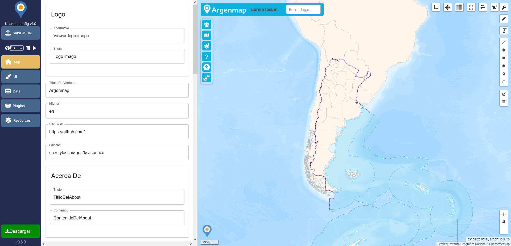

# **Argenmap Editor**  




## **Índice**  
1. [Descripción del Proyecto](#descripción-del-proyecto)  
2. [Características Principales](#características-principales)  
3. [Instalación](#instalación)  
4. [Uso](#uso)  
5. [Tecnologías Utilizadas](#tecnologías-utilizadas)  
6. [Estado del Proyecto](#estado-del-proyecto)  
7. [Próximos Pasos](#próximos-pasos)  

---

## **Descripción del Proyecto**  
Un editor de archivos JSON fácil de usar para facilitar la creación, edición y validación de la configuración del visor Argenmap.

## **Características Principales**  
- **Edición interactiva:** Abre, edita y guarda archivos JSON con facilidad.  
- **Validación en tiempo real:** Verifica que la estructura del JSON sea válida al editar.  
- **Descarga:** Guarda y descarga los cambios realizados en un archivo JSON listo para ser usado por un visor Argenmap.

## **Instalación**  
1. Clona este repositorio:  
   ```bash
   git clone https://github.com/ign-argentina/argenmap-editor.git
   ```
2. Instala las dependencias necesarias:  
   ```bash
   npm install
   ```
3. Inicia la aplicación:  
   ```bash
   npm run dev
   ```
   
## **Uso**  
1. Ejecuta la aplicación siguiendo los pasos de instalación.  
2. Carga un archivo JSON desde tu computadora o utiliza el que está por defecto.  
3. Realiza cambios utilizando la interfaz interactiva.  
4. Descarga el archivo actualizado.  

## **Tecnologías Utilizadas**  
- Next.js, React, HTML, CSS, JSONForms, ajv.

## **Estado del Proyecto**  
- **Completado:**  
  - Interfaz para edición de JSON.  
  - Validación básica de la estructura.  
  - Funcionalidad de guardar estado del formulario.
  - Cargar configuración local.
  - Descarga de la configuración.
  - Configurar idioma del Editor.
  - Limpiar memoria del Editor.  

## **Próximos Pasos**  
  - Implementación del visor.  
  - Mejorar la fomra de guardar el estado del formulario.
  - Mejoras en la interfaz.
  - Varios bugs.  
