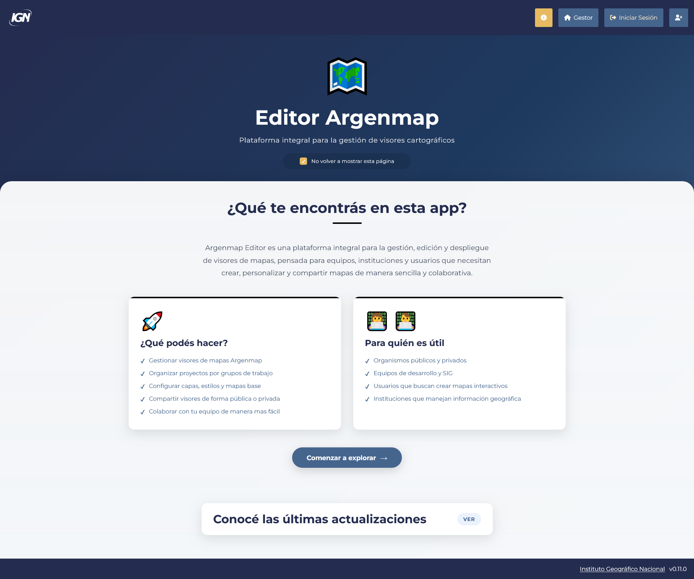
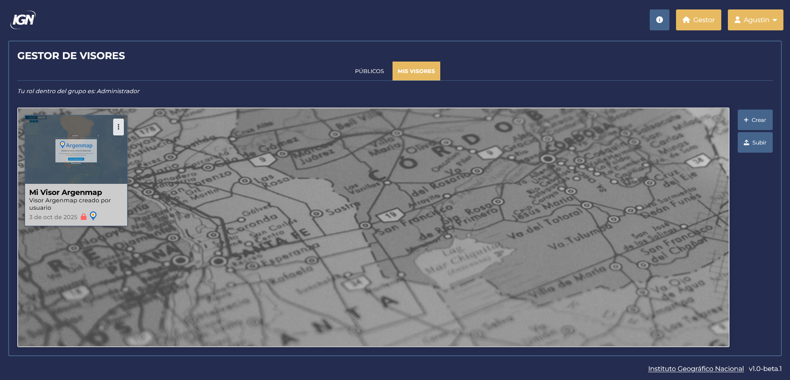
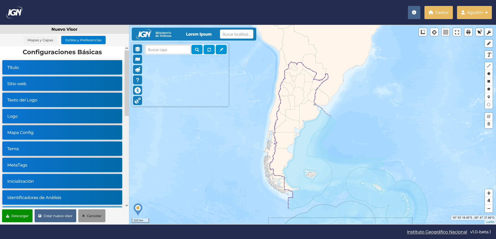

# **Editor Argenmap**

## **Indice**

1. [Descripcion del proyecto](#descripcion-del-proyecto)
2. [Caracteristicas principales](#caracteristicas-principales)
3. [Que podes hacer](#que-podes-hacer)
4. [Para quien es util](#para-quien-es-util)
5. [Tecnologias utilizadas](#tecnologias-utilizadas)

---

## **Descripcion del proyecto**

Editor Argenmap es una plataforma integral para la gestion, edicion y despliegue de visores de mapas, pensada para equipos, instituciones y usuarios que necesitan crear, personalizar y compartir mapas de manera sencilla y colaborativa.

## **Caracteristicas principales**

- **Gestiona visores:** Permite crear, subir, editar, descargar, borrar y publicar visores de mapas.  
  
- **Edicion interactiva:** Presenta un formulario interactivo que permite modificar visores en tiempo real.  
  
- **Usuarios y grupos de trabajo:** Gestiona usuarios y grupos de manera robusta con un sistema de permisos.

## **Que podes hacer**

- Gestionar visores de mapas Argenmap
- Organizar proyectos por grupos de trabajo
- Configurar capas, estilos y mapas base
- Compartir visores de forma publica o privada
- Colaborar con tu equipo de manera mas facil

## **Para quien es util**

- Organismos publicos y privados
- Equipos de desarrollo y SIG
- Usuarios que buscan crear mapas interactivos
- Instituciones que manejan informacion geografica

## **Tecnologias utilizadas**

- Node.js, Vite.js, Express, PostgreSQL, React, React Router, HTML, CSS, JSONForms, ajv.
