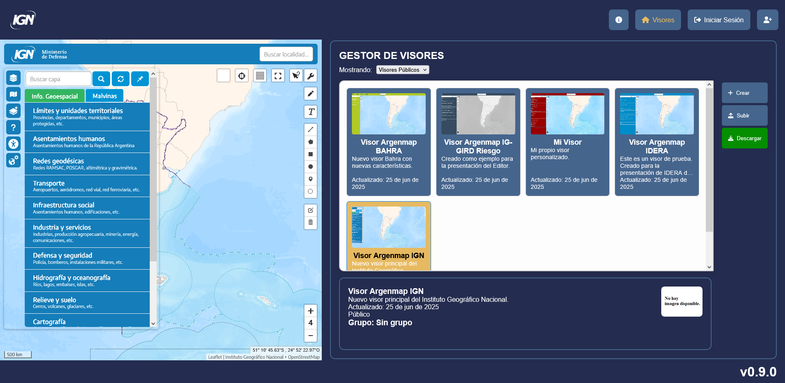

# **Editor Argenmap**  

## **Índice**  
1. [Descripción del Proyecto](#descripción-del-proyecto)  
2. [Características Principales](#características-principales)  
3. [Tecnologías Utilizadas](#tecnologías-utilizadas)  

---

## **Descripción del Proyecto**  
Es una aplicación web desarrollada para crear y gestionar visores hechos con Argenmap.

## **Características Principales**  
- **Gestiona visores:** Permite crear, subir, editar, descargar, borrar y publicar visores de mapas.
  

- **Edición interactiva:** Presenta un formulario interactivo que permite modificar visores en tiempo real.
  

- **Usuarios y grupos de trabajo:** Gestiona usuarios y grupos de manera robusta con un sistema de permisos.
   
## **Tecnologías Utilizadas**  
- Node.js, Vite.js, Express, PostgreSQL, React, React Router, HTML, CSS, JSONForms, ajv.
